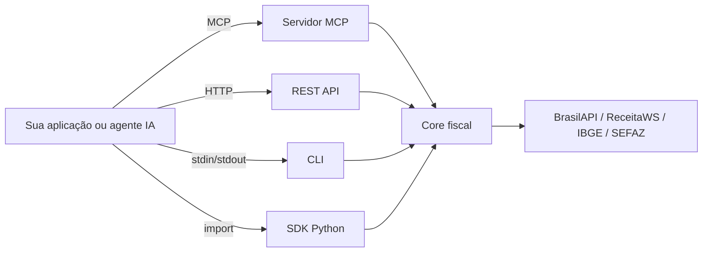

# MCP Fiscal Brasil

Servidor MCP, CLI, REST API e SDK para o sistema fiscal brasileiro.

[](https://pypi.org/project/mcp-fiscal-brasil/)
[](https://www.python.org/)
[](https://modelcontextprotocol.io)
[](https://github.com/nikolasdehor/mcp-fiscal-brasil/blob/main/LICENSE)

## O que e

O `mcp-fiscal-brasil` integra dados fiscais brasileiros (CNPJ, NFe, SPED, Simples Nacional, CNAE, certidoes e mais) em **quatro interfaces** complementares:



## Por que existe

O Brasil tem o sistema fiscal mais complexo do mundo: 27 SEFAZs, NFe + NFSe + SPED + eSocial, cada municipio com seu portal próprio. Integrar IA com dados fiscais brasileiros antes desse projeto significava semanas de código de cola.

Com o `mcp-fiscal-brasil`, **uma linha de código** consulta CNPJ, válida NFe, analisa compliance, compara regimes tributários.

## Recursos chave (v0.2.0)

=== "Tools agenticas"

    Combinacoes pensadas para uso por agentes de IA:

    - `analyze_cnpj_compliance` - relatório consolidado com score 0-100
    - `compare_tax_regimes` - MEI vs Simples vs Lucro Presumido vs Real
    - `risk_score_supplier` - due diligence com recomendação acionavel
    - `validate_nfe_full` - parse XML + chave + situação do emissor
    - `summarize_sped` - sumário executivo de arquivo SPED

=== "Multiplas interfaces"

    Escolha como integrar:

    - **MCP Server**: Claude Desktop, Cursor, qualquer cliente MCP
    - **CLI**: `mcp-fiscal cnpj 12345678000190` no terminal
    - **REST API**: FastAPI com OpenAPI docs
    - **Web UI**: pagina htmx 2.0 servida pela API
    - **npm wrapper**: usar em apps Node.js/TypeScript

=== "Production-grade"

    Pensado para ambientes serios:

    - HTTP retry exponencial (`tenacity`)
    - Cache pluggavel (memory / redis / sqlite)
    - Rate-limit per-host
    - Logs estruturados JSON (`structlog`)
    - Strict typing com `mypy --strict`

## Quick start

```bash
# Instalar
pipx install mcp-fiscal-brasil
# ou
uv tool install mcp-fiscal-brasil

# CLI
mcp-fiscal cnpj 12345678000190
mcp-fiscal compliance 12345678000190
mcp-fiscal regimes --faturamento 500000 --setor serviços --folha 180000

# REST API + Web UI demo
mcp-fiscal-api  # http://localhost:8000
```

```python
# SDK Python
import asyncio
from mcp_fiscal_brasil.agentic import analyze_cnpj_compliance

async def main():
    report = await analyze_cnpj_compliance("12345678000190")
    print(f"Risco: {report.risco_geral} (score {report.score}/100)")
    print(report.resumo_executivo)

asyncio.run(main())
```

## Onde ir agora

[:material-rocket: Comece pelo guia rápido](getting-started/quickstart.md){ .md-button .md-button--primary }
[:material-tools: Explore as tools agenticas](agentic/index.md){ .md-button }
[:material-github: Ver no GitHub](https://github.com/nikolasdehor/mcp-fiscal-brasil){ .md-button }
