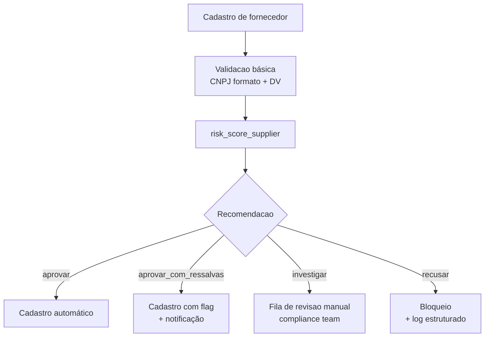

# Due diligence de fornecedores

Como usar o `mcp-fiscal-brasil` para automatizar verificacao de fornecedores em larga escala.

## Cenario

Sua empresa cadastra 100+ fornecedores por mês. Cada cadastro exige:

1. Consultar CNPJ na Receita
2. Verificar regime tributário
3. Conferir situação em certidoes (CND, FGTS, CNDT)
4. Decidir aprovar / pedir documentos / recusar

Sem automação, isso e 30 minutos por fornecedor, feito por uma pessoa do compliance.

Com o `mcp-fiscal`, e uma chamada:

```python
score = await risk_score_supplier(cnpj, criterios_estritos=True)
```

## Fluxo recomendado



## Implementacao em Python

```python
from mcp_fiscal_brasil.agentic import risk_score_supplier
import structlog

log = structlog.get_logger()


async def processar_cadastro_fornecedor(cnpj: str, contratante: dict) -> dict:
    """Decide se cadastra um fornecedor."""
    criterios_estritos = contratante.get("politica_anti_corrupcao", False)

    score = await risk_score_supplier(cnpj, criterios_estritos=criterios_estritos)

    log.info(
        "supplier_evaluated",
        cnpj=cnpj,
        score=score.score,
        recomendacao=score.recomendacao,
        contratante=contratante["id"],
    )

    if score.recomendacao == "recusar":
        return {"status": "bloqueado", "motivos": score.fatores}

    if score.recomendacao == "investigar":
        await enfileirar_revisao_manual(cnpj, score)
        return {"status": "pendente_revisao"}

    if score.recomendacao == "aprovar_com_ressalvas":
        await notificar_compliance(cnpj, score)
        return {"status": "aprovado", "flag": "ressalvas"}

    return {"status": "aprovado"}
```

## Batch processing

```python
import asyncio

async def avaliar_em_massa(cnpjs: list[str]) -> dict[str, str]:
    """Avalia vários CNPJs em paralelo, com limite de concorrencia."""
    sem = asyncio.Semaphore(10)  # max 10 simultaneos

    async def _avaliar_um(cnpj: str) -> tuple[str, str]:
        async with sem:
            score = await risk_score_supplier(cnpj, criterios_estritos=True)
            return cnpj, score.recomendacao

    resultados = await asyncio.gather(*(_avaliar_um(c) for c in cnpjs))
    return dict(resultados)
```

## Auditoria

O score inclui `fatores` (lista de strings) que explicam **porque** a recomendacao foi essa. Armazene-os no log de auditoria:

```python
log.info(
    "supplier_evaluation",
    cnpj=score.cnpj,
    razao_social=score.razao_social,
    score=score.score,
    risco=score.risco,
    recomendacao=score.recomendacao,
    fatores=score.fatores,
    data_analise=score.data_analise.isoformat(),
)
```

Audit trail completo em JSON estruturado, pronto pra Loki / CloudWatch / Datadog.

## Tradeoffs e cuidados

- **Cache**: ative cache (`MCP_FISCAL_CACHE_TTL=3600`) para não repetir consultas dentro de 1 hora
- **Rate limit**: APIs publicas tem limites. Default e conservador, mas se rodar muitos batches, monitore
- **Falsos positivos**: empresas recem-cadastradas as vezes tem `endereco_incompleto`. Combine com regras de negócio especificas
- **Renovacao**: cadastros periodicos (anual / semestral) garantem que mudancas na situação sejam capturadas
